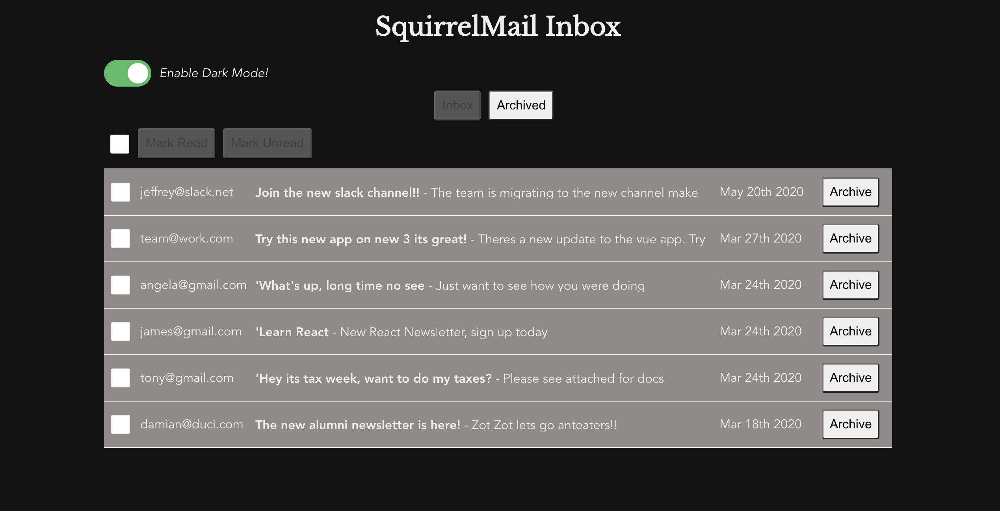
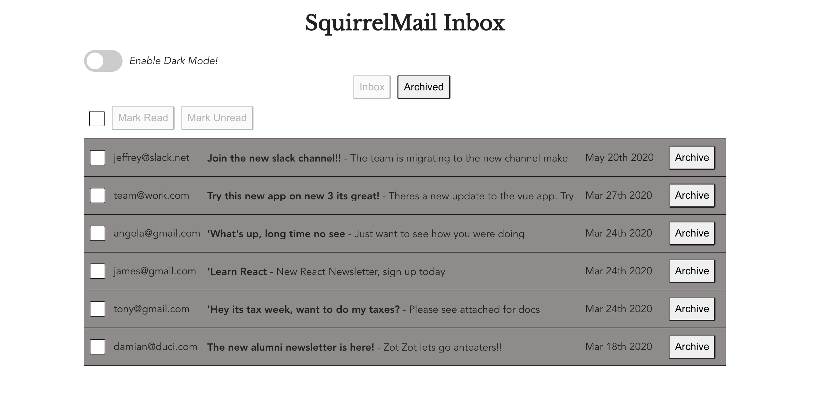
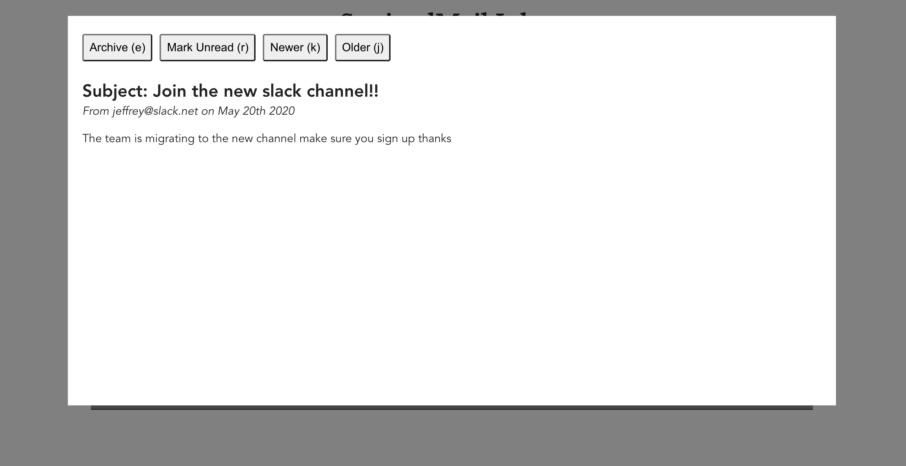

# SquirrelMail Vue


## Technologies Used
vue 3 / vue 2 / javascript / scss / css / html

## Project Description 
Welcome to Squirrel Mail, a gmail like app that allows you to read email in your inbox, archive the emails select, and allows you to toggle a dark theme. Quick keys are used to allow the user to quickly go through the emails forward and backward, and mark read or unread. 

** Check out the live app on [Heroku](https://react-chat-app-client.herokuapp.com/)








## Project Quickstart
```
npm install
```

### Compiles and hot-reloads for development
```
npm run serve
```

### Compiles and minifies for production
```
npm run build
```

### Lints and fixes files
```
npm run lint
```

### Customize configuration
See [Configuration Reference](https://cli.vuejs.org/config/).
